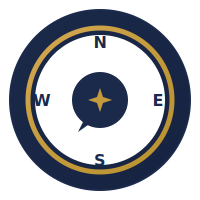

<div align="center">


<br/>

**Speak your dream trip. Watch it come to life.** NovaTour combines **four Amazon Nova AI services** into a voice-driven travel assistant — searching flights, finding hotels, checking weather, generating itineraries, and automating bookings through natural speech.

[](https://aws.amazon.com/ai/generative-ai/nova/)
[](https://github.com/strands-agents/sdk-python)
[](https://ai.google.dev/)

[](https://python.org)
[](https://fastapi.tiangolo.com)
[](https://nextjs.org)
[](https://react.dev)
[](https://tailwindcss.com)
[](https://developers.google.com/maps)
[](https://openweathermap.org/)

</div>

---

## How It Works

> **Say** *"Plan a 5-day trip to Barcelona, $2000 budget"*
> The agent calls flights, hotels, weather, and itinerary tools — delivers results by voice while rendering the itinerary and map visually.
>
> **Say** *"Tell me more about La Sagrada Familia"*
> LOD shifts to narrative mode — the agent becomes a travel podcast narrator.
>
> **Say** *"Book the cheapest flight"*
> Nova Act launches a browser, navigates Google Flights, and extracts booking details autonomously.

---

## Amazon Nova Services

<div align="center">

</div>

| Service | Role |
|---------|------|
| **Nova 2 Sonic** | Real-time speech-to-speech via Strands BidiAgent. ASR + reasoning + TTS + tool calling in one streaming session. |
| **Nova 2 Lite** | Structured itinerary generation and text chat fallback via Bedrock `converse()`. |
| **Nova Act** | Browser automation on Google Flights — navigates, searches, sorts, extracts flight details. |
| **Nova Embeddings** | Multimodal embeddings for destination understanding. |

---

## Voice Pipeline

<div align="center">

</div>

Two concurrent `asyncio` tasks bridge browser audio and Nova Sonic:

```
Browser Mic → resample(16kHz) → base64 → WebSocket → BidiAgent → Nova Sonic (Bedrock)
                                                                       ↓
Speakers ← AudioPlayer(gapless) ← base64 ← WebSocket ← events ← Tool Results
```

**Resilience:** Auto-retry once on BidiAgent failure → fallback to MockAgent → mid-session recovery on transient errors.

---

## 8 Travel Tools

<div align="center">

</div>

| Tool | API | What It Does |
|------|-----|-------------|
| `search_flights` | Gemini 3.1 Flash Lite + Google Search | Real-time flight search with grounding |
| `search_hotels` | Google Places (New) | Hotels with ratings, prices, photos |
| `search_places` | Google Places (New) | POI search with photos, distance sorting |
| `plan_route` | Google Routes v2 | Turn-by-turn directions + polyline |
| `get_weather` | OpenWeather | Current conditions by city or coordinates |
| `get_forecast` | OpenWeather | 5-day daily forecast |
| `plan_itinerary` | Nova 2 Lite (Bedrock) | AI-generated day-by-day itinerary with coordinates |
| `book_flight` | Nova Act | Automated browser booking on Google Flights |

Every tool has a **dynamic mock fallback** — no hardcoded demo data. Mock responses reflect the user's actual query parameters.

---

## Adaptive LOD System

<div align="center">

</div>

| Level | Words | Style | Triggers |
|-------|-------|-------|----------|
| **L1 Brief** | 15-40 | Single sentence, core fact | *"be brief"*, *"too long"*, *"简短点"* |
| **L2 Standard** | 80-150 | Intro + key points + guidance | Default (cold start) |
| **L3 Narrative** | 400-800 | Immersive podcast narration | *"tell me more"*, *"podcast mode"*, *"详细讲讲"* |

**Priority-based detection** with 60+ bilingual patterns (EN + ZH). LOD changes trigger spoken transition phrases: *"Let me tell you the whole story..."*

---

## Quick Start

```bash
# Clone & setup
git clone https://github.com/your-username/NovaTour.git && cd NovaTour
conda create -n novatour python=3.13 -y && conda activate novatour

# Backend
cd novatour/backend && pip install -r requirements.txt
cp ../../.env.example ../.env  # Edit with your API keys

# Frontend
cd ../frontend && npm install

# Run (two terminals)
cd novatour/backend && uvicorn app.main:app --reload --port 8000
cd novatour/frontend && npm run dev

# Test
cd novatour/backend && python -m pytest tests/ -v
```

Open **http://localhost:3000** → Click **Connect** → Click mic → Start talking.

### Environment Variables

```env
# Required — AWS
AWS_ACCESS_KEY_ID=...
AWS_SECRET_ACCESS_KEY=...
AWS_DEFAULT_REGION=us-east-1

# Travel APIs (mock mode without these)
GOOGLE_API_KEY=...              # Gemini flight search
GOOGLE_MAPS_API_KEY=...        # Hotels, places, routes
OPENWEATHER_API_KEY=...        # Weather + forecast
GEOAPIFY_API_KEY=...           # Map tiles + routing
NOVA_ACT_API_KEY=...           # Browser booking
```

---

## API Reference

```bash
# Health check
curl http://localhost:8000/health

# Text chat
curl -X POST http://localhost:8000/api/chat \
  -H "Content-Type: application/json" \
  -d '{"message": "Best time to visit Barcelona?", "session_id": "demo"}'

# Voice — connect via WebSocket
websocat ws://localhost:8000/ws/voice/my-session
```

### WebSocket Protocol

| Direction | Event | Purpose |
|-----------|-------|---------|
| `Client → Server` | `audio` | Microphone PCM chunks (base64) |
| `Client → Server` | `text` | Text input fallback |
| `Client → Server` | `lod` | Explicit LOD switch (1/2/3) |
| `Server → Client` | `audio` | Nova Sonic speech output |
| `Server → Client` | `transcript` | User/assistant transcripts |
| `Server → Client` | `tool_call` | Tool lifecycle events |
| `Server → Client` | `itinerary` | Generated itinerary data |
| `Server → Client` | `interruption` | Barge-in — clear audio buffer |
| `Server → Client` | `voice_state` | Agent state (idle/responding/interrupted) |
| `Server → Client` | `lod_change` | LOD level confirmation + transition phrase |

---

## Project Structure

```
novatour/
├── backend/
│   ├── app/
│   │   ├── main.py              # FastAPI + CORS + health
│   │   ├── config.py            # Pydantic Settings (.env)
│   │   ├── voice/
│   │   │   ├── ws_handler.py    # WebSocket bridge (dual asyncio tasks)
│   │   │   ├── sonic_agent.py   # BidiAgent + MockAgent fallback
│   │   │   └── voice_state.py   # 4-state response lifecycle
│   │   ├── tools/               # 8 tools with @tool decorator
│   │   ├── lod/                 # LOD engine (signal detection, intent, state)
│   │   ├── chat/                # REST text chat fallback
│   │   └── utils/               # TTS sanitization, resilience
│   └── tests/                   # 102 unit tests + E2E voice tests
└── frontend/
    └── src/
        ├── app/page.tsx         # Three-column layout
        ├── hooks/useVoiceAgent.ts # WebSocket + audio pipeline
        └── ui/                  # VoicePanel, ChatInterface, ItineraryWorkspace, TripMap, NovaActViewer
```

---

<div align="center">



**NovaTour** — Voice-first travel planning powered by Amazon Nova

<a href="https://aws.amazon.com/ai/generative-ai/nova/"></a>
<a href="https://ai.google.dev/"></a>
<a href="https://github.com/strands-agents/sdk-python"></a>

*Built for Amazon Nova Hackathon 2026*

</div>
