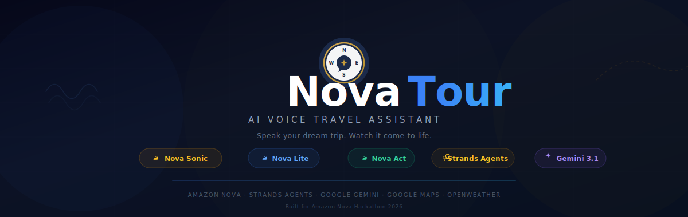
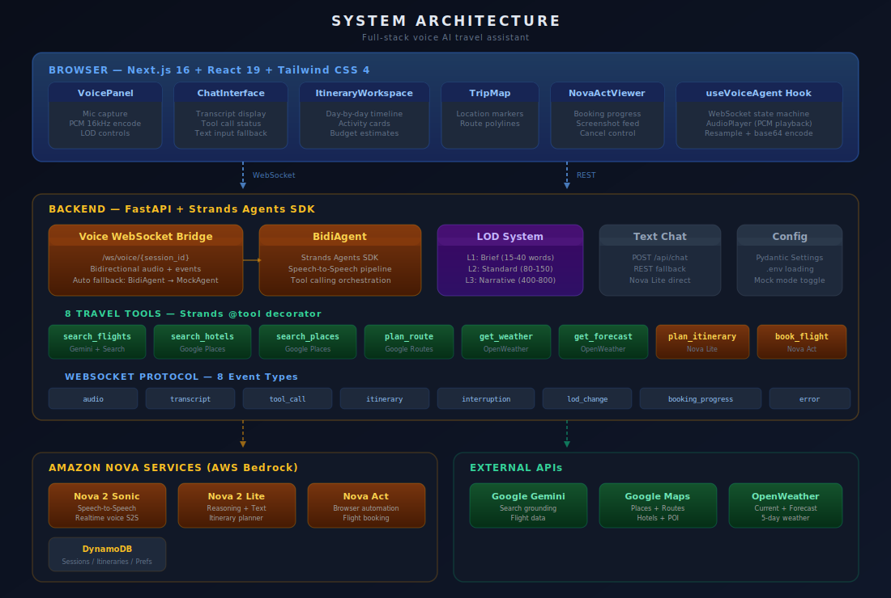
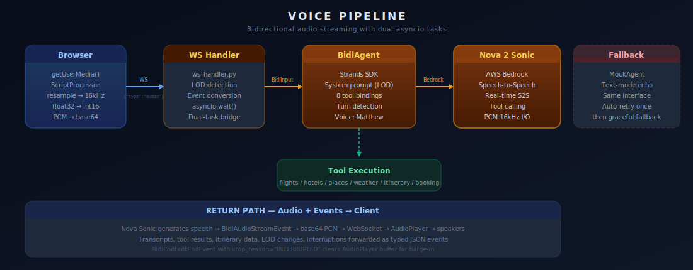
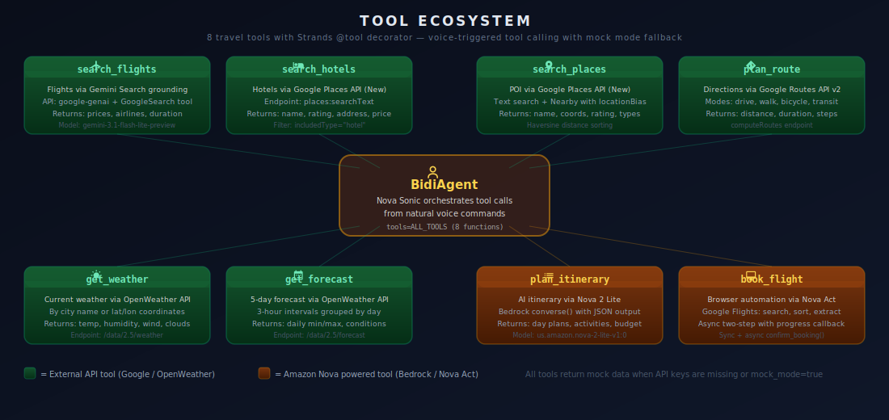
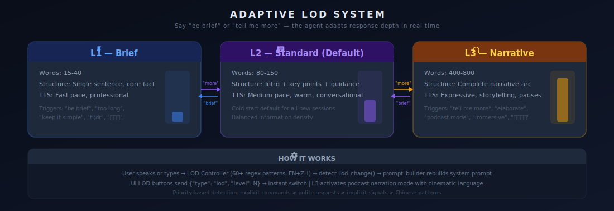

<div align="center">



<br/>

**Speak your dream trip. Watch it come to life.** NovaTour is a voice-driven AI travel assistant powered by **four Amazon Nova services**. Through real-time bidirectional voice streaming, it searches flights, finds hotels, discovers places, checks weather, generates itineraries, and automates flight booking — all from natural speech.

<br/>

[](https://aws.amazon.com/ai/generative-ai/nova/)
[](https://github.com/strands-agents/sdk-python)

[](https://python.org)
[](https://fastapi.tiangolo.com)
[](https://nextjs.org)
[](https://react.dev)
[](https://tailwindcss.com)
[](https://docs.pydantic.dev)

---

[Amazon Nova Services](#-amazon-nova-services) · [Features](#-features) · [Architecture](#-system-architecture) · [Voice Pipeline](#-voice-pipeline) · [Tool Ecosystem](#-tool-ecosystem) · [LOD System](#-adaptive-lod-system) · [Quick Start](#-quick-start) · [API Reference](#-api-reference) · [Project Structure](#-project-structure)

</div>

---

## What is NovaTour?

NovaTour is a **voice-first AI travel assistant** that combines four Amazon Nova AI services into a seamless speech-to-speech travel planning experience. Built on the **Strands Agents SDK**, it uses Nova Sonic for real-time voice conversation, Nova Lite for intelligent reasoning, Nova Act for browser-automated booking, and integrates with Google Maps, OpenWeather, and Gemini for live travel data.

### The Core Innovation

Most travel AI chatbots give you a text box. NovaTour gives you a **voice conversation with an agent that can act** — searching real flights, finding real hotels, generating real itineraries, and booking real tickets through browser automation, all while adapting its verbosity to your preference in real time.

> **Say** "Plan a 5-day Tokyo trip, $3000 budget, I love ramen" → Agent calls 4+ tools: flights, hotels, weather, itinerary — delivers results by voice while displaying the itinerary visually.
>
> **Say** "Tell me more about Senso-ji" → LOD shifts to narrative mode — the agent becomes a travel podcast narrator with vivid, cinematic descriptions.
>
> **Say** "Be brief" → LOD shifts back to concise mode — single-sentence, core-fact responses.
>
> **Say** "Book the cheapest flight" → Nova Act launches a browser, navigates Google Flights, searches, sorts, and extracts booking details autonomously.

---

## ✦ Amazon Nova Services

NovaTour is built on **four Amazon Nova services**, each handling a distinct layer of the experience:

| Service | Model ID | Role | How It's Used |
|---------|----------|------|---------------|
| **Nova 2 Sonic** | `amazon.nova-2-sonic-v1:0` | Real-time voice | Bidirectional speech-to-speech via Strands BidiAgent. Handles ASR, reasoning, TTS, and tool calling in a single streaming session. Voice: Matthew, 16kHz PCM. |
| **Nova 2 Lite** | `us.amazon.nova-2-lite-v1:0` | Reasoning engine | Generates structured day-by-day itineraries via Bedrock `converse()`. Also powers the text chat REST fallback. JSON mode with markdown fence stripping. |
| **Nova Act** | Nova Act SDK | Browser automation | Automates flight booking on Google Flights. Navigates, searches, sorts by price, extracts flight details. Supports sync and async two-step booking with progress callbacks. |
| **Nova Embeddings** | `amazon.nova-2-multimodal-embeddings-v1:0` | Multimodal embeddings | Configured for destination understanding and semantic search capabilities. |

### Strands Agents Integration

The voice pipeline is built on the **Strands Agents SDK** — specifically the experimental `BidiAgent` for bidirectional streaming:

```python
from strands.experimental.bidi.agent.agent import BidiAgent
from strands.experimental.bidi.models.nova_sonic import BidiNovaSonicModel

model = BidiNovaSonicModel(
    model_id="amazon.nova-2-sonic-v1:0",
    provider_config={
        "audio": {"voice": "matthew", "input_rate": 16000, "output_rate": 16000, "format": "pcm"},
        "turn_detection": {"endpointingSensitivity": "MEDIUM"},
        "inference": {"temperature": 0.7, "max_tokens": 1024, "top_p": 0.9},
    },
)

agent = BidiAgent(
    model=model,
    tools=ALL_TOOLS,          # 8 travel tools with @tool decorator
    system_prompt=system_prompt,  # LOD-aware dynamic prompt
)
```

All 8 travel tools use the Strands `@tool` decorator and are automatically bound to the BidiAgent for voice-triggered tool calling. Nova Sonic decides when to invoke tools based on the conversation context.

---

## ✦ Features

| Feature | Description |
|---------|-------------|
| **Voice-First Interface** | Real-time bidirectional audio streaming via WebSocket. Mic capture at browser sample rate, resampled to 16kHz PCM, streamed to Nova Sonic. Response audio plays back through AudioContext with gapless scheduling. |
| **8 Live Travel Tools** | Flights (Gemini Search), hotels (Google Places), attractions (Google Places), routes (Google Routes v2), current weather + 5-day forecast (OpenWeather), AI itineraries (Nova Lite), flight booking (Nova Act). |
| **Adaptive LOD System** | 3-level response verbosity that switches dynamically from user voice commands. L1: Brief (15-40 words). L2: Standard (80-150). L3: Narrative podcast mode (400-800). Bilingual detection (EN + ZH). |
| **Browser-Automated Booking** | Nova Act navigates Google Flights, searches flights, sorts by price, and extracts details. Supports synchronous (tool call) and asynchronous (two-step with progress updates) booking. |
| **Three-Column Layout** | Chat transcript + Itinerary workspace + Map view. Real-time tool call status indicators. Budget estimates. Day-by-day activity timelines. |
| **Barge-In Support** | User can interrupt the agent mid-sentence. `BidiContentEndEvent` with `INTERRUPTED` stop reason clears the AudioPlayer buffer immediately. |
| **Mock Mode Fallback** | Every tool returns realistic mock data when APIs are unavailable or `MOCK_MODE=true`. BidiAgent auto-retries once, then falls back to MockAgent with text-mode echo. |
| **Bilingual Support** | LOD detection and system prompts support both English and Chinese commands. The agent adapts its response language to match the user's input. |

---

## ✦ System Architecture

<div align="center">

</div>

### Stack Overview

| Layer | Technology | Role |
|-------|-----------|------|
| **Frontend** | Next.js 16 · React 19 · TypeScript | Three-column app shell, WebSocket state machine via `useVoiceAgent` hook |
| **Styling** | Tailwind CSS 4 | Dark-themed responsive UI with tool call status indicators |
| **Backend** | Python 3.13 · FastAPI | WebSocket voice bridge + REST text chat, CORS configured |
| **Agent Framework** | Strands Agents SDK | BidiAgent for speech-to-speech with tool calling orchestration |
| **Voice Engine** | Amazon Nova 2 Sonic | Real-time S2S via AWS Bedrock, PCM 16kHz bidirectional audio |
| **Reasoning** | Amazon Nova 2 Lite | Itinerary generation + text chat via Bedrock `converse()` API |
| **Browser Automation** | Amazon Nova Act | Flight booking on Google Flights with step-by-step actions |
| **Travel Data** | Google Gemini · Google Maps · OpenWeather | Live flight search, hotel/POI data, routes, weather |
| **Persistence** | Amazon DynamoDB | Sessions, itineraries, and user preferences (3 tables) |
| **Validation** | Pydantic v2 + Pydantic Settings | Config management with `.env` loading and type safety |

### WebSocket Protocol

The frontend and backend communicate over a single WebSocket connection with **8 typed JSON event types**:

| Direction | Event | Payload | Purpose |
|-----------|-------|---------|---------|
| Client → Server | `audio` | `{data: "<base64 PCM>"}` | Microphone audio chunks |
| Client → Server | `text` | `{text: "..."}` | Text input fallback |
| Client → Server | `lod` | `{level: 1\|2\|3}` | Explicit LOD switch from UI |
| Server → Client | `audio` | `{data: "<base64 PCM>"}` | Nova Sonic speech output |
| Server → Client | `transcript` | `{text, role, is_final}` | User/assistant transcripts |
| Server → Client | `tool_call` | `{name, input, status, result}` | Tool call lifecycle events |
| Server → Client | `itinerary` | `{data: ItineraryData}` | Generated itinerary payload |
| Server → Client | `interruption` | `{}` | Barge-in detected, clear audio |
| Server → Client | `lod_change` | `{level: N}` | LOD level confirmation |
| Server → Client | `booking_progress` | `{task_id, step, status}` | Async booking progress |
| Server → Client | `error` | `{message: "..."}` | Error notifications |

---

## ✦ Voice Pipeline

<div align="center">

</div>

### End-to-End Audio Flow

```
Browser Microphone                    Nova Sonic (Bedrock)
────────────────                      ────────────────────
getUserMedia()                        Speech-to-Speech model
  │ AudioContext                        │ ASR + Reasoning + TTS
  │ ScriptProcessor (4096 frames)       │ Tool calling decisions
  │ resample(srcRate → 16kHz)           │ PCM 16kHz output
  │ float32 → int16 → base64           │
  ▼                                     ▼
WebSocket ──── {"type":"audio"} ────► WS Handler ──► BidiAgent ──► Bedrock
              base64 PCM chunks        │              │
              ◄──── {"type":"audio"} ──┘              │
              base64 PCM response                     ▼
                                                 Tool Execution
                                                 (if triggered)
  AudioPlayer                                        │
  │ base64 → Float32Array                           │
  │ createBuffer(16kHz)                              │
  │ Gapless scheduling                   ToolResultStreamEvent
  │ clearBuffer() on interruption                    │
  ▼                                                  ▼
Speakers                              Response continues with
                                      tool results in context
```

### Dual-Task Architecture

The WebSocket handler runs two concurrent `asyncio` tasks:

1. **`forward_to_agent()`** — receives client messages, detects LOD changes via regex, forwards audio/text to BidiAgent
2. **`forward_to_client()`** — receives BidiAgent events (audio, transcripts, tool calls), converts them to the WebSocket protocol, intercepts itinerary data from tool results

Both tasks run via `asyncio.wait(FIRST_COMPLETED)` — if either fails, the other is cancelled for clean shutdown.

### Resilience

- **Retry once** — if BidiAgent fails to start, retry with a fresh instance
- **Graceful fallback** — if retry also fails, switch to MockAgent (text-mode echo) and notify the client
- **Runtime fallback** — if BidiAgent crashes mid-session, automatically switch to MockAgent and continue

---

## ✦ Tool Ecosystem

<div align="center">

</div>

### Tool Details

| Tool | API | Key Capabilities |
|------|-----|-----------------|
| **`search_flights`** | Google Gemini (`gemini-2.5-flash-preview-05-20`) with Search grounding | Real-time flight search with prices, airlines, duration, stops. Uses `GoogleSearch` tool for grounding against live web data. Returns source URLs. |
| **`search_hotels`** | Google Places API (New) — `places:searchText` | Hotel search by city with ratings, reviews, addresses, price levels, coordinates. Field mask optimized for travel-relevant data. |
| **`search_places`** | Google Places API (New) — `places:searchText` + `searchNearby` | Attractions, restaurants, POI search. Location bias with radius. Haversine distance calculation and sorting. |
| **`plan_route`** | Google Routes API v2 — `computeRoutes` | Directions with distance (km), duration (min), turn-by-turn navigation steps. Supports drive, walk, bicycle, transit modes. |
| **`get_weather`** | OpenWeather API — `/data/2.5/weather` | Current conditions: temperature, feels-like, humidity, wind speed/direction, pressure, visibility, cloud cover. By city name or coordinates. |
| **`get_forecast`** | OpenWeather API — `/data/2.5/forecast` | 5-day forecast: daily min/max temperatures, conditions, humidity, wind. 3-hour interval data grouped by day. |
| **`plan_itinerary`** | Amazon Nova 2 Lite via Bedrock `converse()` | AI-generated day-by-day itinerary with themed days, timed activities, locations, durations, and budget breakdowns. Structured JSON output. |
| **`book_flight`** | Amazon Nova Act SDK | Automated browser interaction on Google Flights. Navigates, fills search form, sorts by price, extracts cheapest flight details. Sync and async modes. |

### Mock Mode Architecture

Every tool follows the same resilience pattern:

```python
@tool
def search_flights(origin, destination, departure_date, ...) -> dict:
    if settings.mock_mode:
        return MOCK_FLIGHTS                    # Static mock data

    try:
        # ... real API call ...
        return real_result
    except Exception:
        return {**MOCK_FLIGHTS, "fallback_reason": str(e)}  # Graceful degradation
```

This ensures the system is always demonstrable — with or without live API keys.

---

## ✦ Adaptive LOD System

<div align="center">

</div>

The **Level of Detail (LOD) system** dynamically controls the agent's response depth based on user voice commands. It operates at three levels with distinct word ranges, response structures, and TTS delivery styles.

### How LOD Detection Works

The LOD controller uses **regex pattern matching** against user input to detect verbosity intent — no LLM call required:

| Intent | Trigger Patterns (EN) | Trigger Patterns (ZH) | LOD Change |
|--------|-----------------------|-----------------------|------------|
| **Less detail** | "be brief", "too long", "keep it simple", "tl;dr", "get to the point" | "简短", "太长", "简单点", "快点说" | current - 1 |
| **More detail** | "tell me more", "elaborate", "go deeper", "podcast mode", "immersive" | "详说", "展开说", "完整", "继续讲" | current + 1 |

### LOD Level Configurations

| Level | Word Range | Structure | TTS Style | Special Mode |
|-------|-----------|-----------|-----------|-------------|
| **L1 Brief** | 15–40 | Single sentence, core fact | Fast pace, professional, no filler | — |
| **L2 Standard** | 80–150 | Introduction + key points + guidance | Medium pace, warm, conversational | Cold start default |
| **L3 Narrative** | 400–800 | Complete narrative arc | Expressive, storytelling, dramatic pauses | Podcast narration mode |

### Podcast Narration Mode (L3)

When LOD reaches level 3, the system prompt is augmented with **podcast narration instructions**:

> *"Speak like a solo travel podcast narrator. Use vivid, specific, sensorial, cinematic language. Weave micro-stories and local details. Avoid lists; prefer scene-by-scene progression."*

The agent transforms from a factual assistant into an immersive storyteller — building hooks, thematic segments, and reflective closings around travel content.

---

## ✦ Quick Start

### Prerequisites

- [Conda](https://docs.conda.io/en/latest/) (Miniconda or Anaconda)
- [Node.js](https://nodejs.org/) 18+
- [AWS credentials](https://aws.amazon.com/) with Bedrock access (us-east-1)
- API keys: [Google Gemini](https://aistudio.google.com/apikey) · [Google Maps](https://console.cloud.google.com/apis/credentials) · [OpenWeather](https://openweathermap.org/api)

### 1. Clone & Set Up

```bash
git clone https://github.com/your-username/NovaTour.git
cd NovaTour

conda create -n novatour python=3.13 -y
conda activate novatour
```

### 2. Install Dependencies

```bash
# Backend
cd novatour/backend
pip install -r requirements.txt

# Frontend
cd ../frontend
npm install
```

> **Note:** Nova Act must be installed separately due to dependency conflicts with Strands Agents:
> ```bash
> pip install -r requirements-nova-act.txt --no-deps
> ```

### 3. Configure Environment

```bash
cp novatour/.env.example novatour/.env
```

Edit `novatour/.env`:

```env
# Required — AWS
AWS_ACCESS_KEY_ID=your_aws_access_key
AWS_SECRET_ACCESS_KEY=your_aws_secret_key
AWS_DEFAULT_REGION=us-east-1

# Required — Nova Models
NOVA_SONIC_MODEL_ID=amazon.nova-2-sonic-v1:0
NOVA_LITE_MODEL_ID=us.amazon.nova-2-lite-v1:0

# Travel APIs (optional — mock mode without these)
GOOGLE_API_KEY=your_gemini_key           # Flight search
GOOGLE_MAPS_API_KEY=your_maps_key       # Hotels, places, routes
OPENWEATHER_API_KEY=your_weather_key    # Weather + forecast
NOVA_ACT_API_KEY=your_nova_act_key      # Browser booking
```

### 4. Run

```bash
# Terminal 1 — Backend (FastAPI on :8000)
conda activate novatour
cd novatour/backend
uvicorn app.main:app --reload --port 8000

# Terminal 2 — Frontend (Next.js on :3000)
cd novatour/frontend
npm run dev
```

Open **[http://localhost:3000](http://localhost:3000)** → Click **Connect** → Click the mic button → Start talking.

### 5. Test

```bash
conda activate novatour
cd novatour/backend
python -m pytest tests/ -v
```

---

## ✦ Demo Scenario

1. Open http://localhost:3000, click **Connect**, then the **mic button**
2. Say: *"Plan a 5-day Tokyo trip, $3000 budget, I love ramen"*
3. Watch tools fire: `search_flights` → `search_hotels` → `get_weather` → `plan_itinerary`
4. The itinerary appears in the center panel with day-by-day activities and budget
5. Say *"Tell me more about Senso-ji"* — LOD switches to narrative mode
6. Say *"Be brief"* — switches back to concise mode
7. Say *"Book the cheapest flight"* — Nova Act opens a browser and searches Google Flights

---

## ✦ API Reference

| Endpoint | Method | Description |
|----------|--------|-------------|
| `/ws/voice/{session_id}` | WebSocket | Bidirectional voice streaming — primary interface |
| `/api/chat` | POST | Text chat fallback via Nova 2 Lite |
| `/health` | GET | Health check — returns `{"status": "ok"}` |

### WebSocket Voice Protocol

**Client → Server:**
```json
{"type": "audio", "data": "<base64 PCM 16kHz>"}
{"type": "text", "text": "Hello"}
{"type": "lod", "level": 1}
```

**Server → Client:**
```json
{"type": "audio", "data": "<base64 PCM 16kHz>"}
{"type": "transcript", "text": "...", "role": "assistant", "is_final": true}
{"type": "tool_call", "name": "search_flights", "status": "calling", "input": {...}}
{"type": "tool_call", "name": "search_flights", "status": "complete", "result": "..."}
{"type": "itinerary", "data": {"destination": "Tokyo", "days": 5, ...}}
{"type": "lod_change", "level": 3}
{"type": "interruption"}
{"type": "error", "message": "..."}
```

### Text Chat

```bash
curl -X POST http://localhost:8000/api/chat \
  -H "Content-Type: application/json" \
  -d '{"message": "What is the best time to visit Tokyo?", "session_id": "test"}'
```

---

## ✦ Project Structure

```
Nova/
├── README.md
├── assets/                              # SVG diagrams for documentation
│   ├── hero-banner.svg
│   ├── architecture.svg
│   ├── voice-pipeline.svg
│   ├── tool-ecosystem.svg
│   └── lod-system.svg
│
├── novatour/                            # Core application
│   ├── .env.example                     # Environment template
│   ├── backend/
│   │   ├── requirements.txt             # Python deps (FastAPI, Strands, boto3, httpx)
│   │   ├── app/
│   │   │   ├── main.py                  # FastAPI entry — CORS, router mounting
│   │   │   ├── config.py               # Pydantic Settings — all env vars
│   │   │   ├── voice/
│   │   │   │   ├── sonic_agent.py      # BidiAgent creation + MockAgent fallback
│   │   │   │   └── ws_handler.py       # WebSocket bridge — dual asyncio tasks
│   │   │   ├── tools/
│   │   │   │   ├── __init__.py         # ALL_TOOLS registry (8 tools)
│   │   │   │   ├── flights.py          # Gemini Search grounding
│   │   │   │   ├── hotels.py           # Google Places (New) — hotels
│   │   │   │   ├── places.py           # Google Places (New) — POI
│   │   │   │   ├── routes.py           # Google Routes API v2
│   │   │   │   ├── weather.py          # OpenWeather (current + forecast)
│   │   │   │   ├── itinerary.py        # Nova Lite via Bedrock converse()
│   │   │   │   └── booking.py          # Nova Act browser automation
│   │   │   ├── lod/
│   │   │   │   ├── config.py           # LOD level definitions (L1/L2/L3)
│   │   │   │   ├── controller.py       # Regex intent detection (EN + ZH)
│   │   │   │   ├── prompt_builder.py   # Dynamic system prompt assembly
│   │   │   │   └── cold_start.py       # Initial LOD = 2 for new sessions
│   │   │   ├── chat/
│   │   │   │   └── text_handler.py     # REST /api/chat — Nova Lite fallback
│   │   │   └── utils/                  # Audio utilities
│   │   └── tests/                      # pytest suite
│   │       ├── test_tools.py           # Tool unit tests
│   │       ├── test_api_integrations.py # API integration tests
│   │       └── e2e/                    # End-to-end tests
│   │
│   └── frontend/
│       ├── package.json                # Next.js 16, React 19, Tailwind 4
│       └── src/
│           ├── app/
│           │   ├── layout.tsx          # Root layout — Geist font, metadata
│           │   ├── page.tsx            # Three-column layout (Chat + Itinerary + Map)
│           │   └── globals.css         # Tailwind base styles
│           ├── hooks/
│           │   └── useVoiceAgent.ts    # WebSocket state machine + audio pipeline
│           ├── ui/
│           │   ├── VoicePanel.tsx      # Connection + mic + LOD controls
│           │   ├── ChatInterface.tsx   # Transcript + tool call display + text input
│           │   ├── ItineraryWorkspace.tsx # Day-by-day itinerary + budget display
│           │   └── NovaActViewer.tsx   # Booking progress overlay with screenshots
│           ├── types/
│           │   └── voice.ts            # TypeScript types (8 event types, data models)
│           └── utils/
│               └── audio.ts            # PCM encode/decode, resample, AudioPlayer
│
└── reference/                           # Development reference (read-only)
    ├── docs/                            # Planning & research documents
    ├── projects/                        # Reference implementations
    └── deps/                            # SDK source & sample repos
        ├── sdk/                         # strands-agents, nova-act, strands-tools
        └── samples/                     # 6 Nova sample repositories
```

---

## ✦ Technology Deep Dive

### Frontend Audio Pipeline

The browser captures microphone audio through `getUserMedia()`, processes it through a `ScriptProcessorNode`, and streams it as base64-encoded PCM:

```
getUserMedia({sampleRate: 16000, echoCancellation: true, noiseSuppression: true})
    → AudioContext.createMediaStreamSource()
    → ScriptProcessor(bufferSize=4096)
    → resample(browserRate → 16000) via linear interpolation
    → float32ToInt16()
    → pcmToBase64()
    → WebSocket.send({"type": "audio", "data": base64})
```

Response audio uses a custom `AudioPlayer` class that schedules PCM buffers gaplessly:

```typescript
const buffer = context.createBuffer(1, samples.length, 16000);
source.start(Math.max(now, nextStartTime));  // Gapless scheduling
nextStartTime = startTime + buffer.duration;
```

### Backend Session Management

Each WebSocket connection creates a dedicated voice session:

1. **Session creation** — `create_voice_agent(session_id, lod_level)` instantiates a BidiAgent
2. **Dual-task bridge** — Two asyncio tasks run concurrently: `forward_to_agent` + `forward_to_client`
3. **LOD detection** — Text input is checked against regex patterns before forwarding
4. **Event conversion** — BidiAgent events are mapped to the WebSocket JSON protocol
5. **Cleanup** — Agent is stopped, session removed from `_active_sessions` dict

### Tool Calling Flow

Nova Sonic decides autonomously when to call tools based on conversation context:

```
User: "Find me hotels in Paris"
    → Nova Sonic recognizes hotel search intent
    → Emits ToolUseStreamEvent(tool_name="search_hotels", input={"city": "Paris"})
    → WS Handler forwards as {"type": "tool_call", "name": "search_hotels", "status": "calling"}
    → search_hotels() calls Google Places API
    → Result returned to BidiAgent
    → Emits ToolResultStreamEvent with results
    → WS Handler forwards as {"type": "tool_call", "status": "complete", "result": "..."}
    → Nova Sonic generates voice response incorporating hotel results
    → Audio streamed back to client
```

---

<div align="center">

**NovaTour** — Voice-driven travel planning with Amazon Nova AI

<a href="https://aws.amazon.com/ai/generative-ai/nova/"></a>
<a href="https://github.com/strands-agents/sdk-python"></a>

</div>
