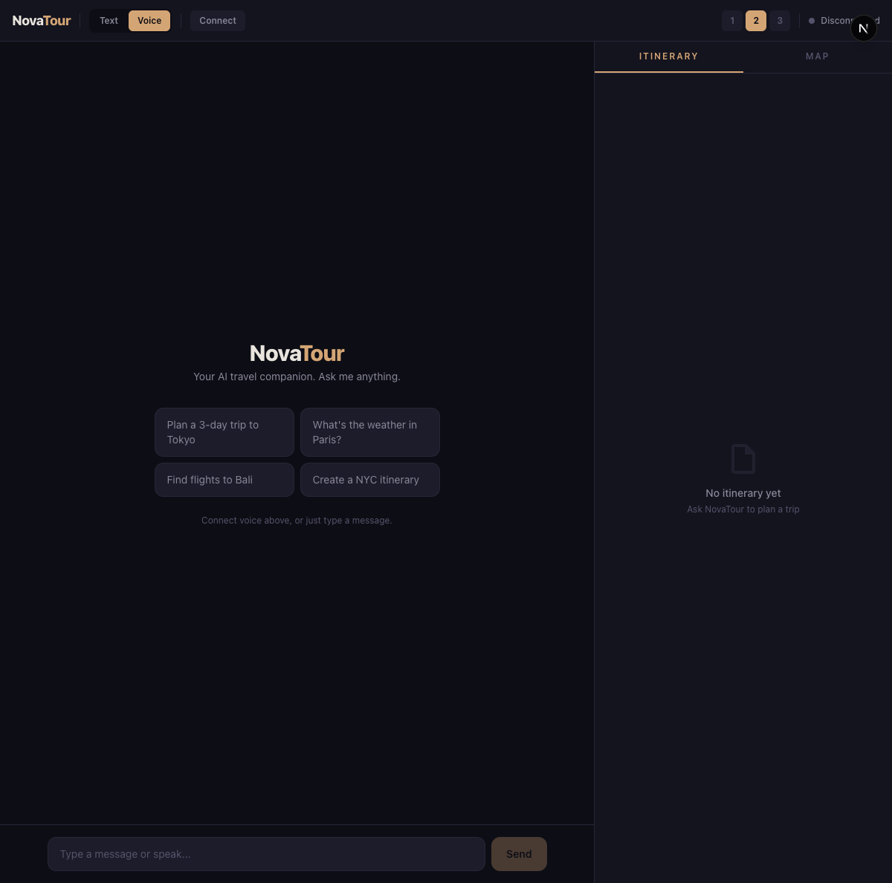

<div align="center">


[](https://aws.amazon.com/ai/generative-ai/nova/)
[](https://github.com/strands-agents/sdk-python)
[](https://ai.google.dev/)
[](https://python.org)
[](https://fastapi.tiangolo.com)
[](https://nextjs.org)
[](https://react.dev)
[](https://tailwindcss.com)
[](https://developers.google.com/maps)
[](https://openweathermap.org/)

**Speak your dream trip. Watch it come to life.**

*Built for Amazon Nova Hackathon 2026*

</div>

---

## What is NovaTour?

NovaTour is a **voice-first AI travel assistant** that lets you plan entire trips through natural conversation. Powered by **Amazon Nova Sonic** for real-time speech-to-speech interaction and **Strands Agents SDK** for intelligent tool orchestration, it transforms spoken requests into complete travel plans — with flights, hotels, weather, routes, and day-by-day itineraries generated live.

### Key Highlights

- **Real-Time Voice Interaction** — Full-duplex speech-to-speech via Nova Sonic. Talk naturally, get spoken responses with live transcription.
- **8 Integrated Travel Tools** — Flights (Gemini 3.1), hotels & POI (Google Places), routes (Google Routes v2), weather (OpenWeather), itinerary generation (Nova Lite), and automated booking (Nova Act).
- **Adaptive Level-of-Detail** — 60+ bilingual patterns dynamically shift response length. Say *"tell me more"* for podcast-style narration, *"简短点"* for quick facts.
- **Live Visual Rendering** — Itinerary timelines, interactive maps with route polylines, and real-time booking progress, all streamed via WebSocket alongside voice.

---

## How It Works

> **Say** *"Plan a 5-day trip to Barcelona, $2000 budget"*
> The agent calls flights, hotels, weather, and itinerary tools — delivers results by voice while rendering the itinerary and map visually.
>
> **Say** *"Tell me more about La Sagrada Familia"*
> LOD shifts to narrative mode — the agent becomes a travel podcast narrator with rich, immersive descriptions.
>
> **Say** *"Book the cheapest flight"*
> Nova Act launches a browser, navigates Google Flights, and extracts booking details autonomously.

---

## UI Preview

<div align="center">

<br/><em>Chat-first interface with voice controls, suggestion chips, and tabbed side panel</em>
</div>

---

## System Architecture

<div align="center">

</div>

### Architecture Overview

```
┌─────────────────────────────────────────────────────────────────────────┐
│  BROWSER — Next.js 16 + React 19 + Tailwind CSS 4                     │
│  ┌──────────┐ ┌──────────────┐ ┌──────────────────┐ ┌───────────────┐ │
│  │VoicePanel│ │ChatInterface │ │ItineraryWorkspace│ │   TripMap     │ │
│  │Mic + LOD │ │Messages+Input│ │Timeline + Budget │ │Markers+Routes │ │
│  └────┬─────┘ └──────┬───────┘ └──────────────────┘ └───────────────┘ │
│       │    useVoiceAgent Hook — WebSocket state machine + AudioPlayer  │
└───────┼───────────────┼───────────────────────────────────────────────┘
        │ WebSocket     │ REST
        ▼               ▼
┌─────────────────────────────────────────────────────────────────────────┐
│  BACKEND — FastAPI + Strands Agents SDK                                │
│  ┌─────────────────┐ ┌──────────┐ ┌──────────┐ ┌───────────────────┐  │
│  │ Voice WS Bridge │→│BidiAgent │ │LOD System│ │ Text Chat (REST)  │  │
│  │ /ws/voice/{sid} │ │ Strands  │ │ 3 levels │ │ POST /api/chat    │  │
│  └────────┬────────┘ └────┬─────┘ └──────────┘ └───────────────────┘  │
│           │               │                                            │
│  ┌────────┴───────────────┴────────────────────────────────────────┐   │
│  │  8 TRAVEL TOOLS — Strands @tool decorator + retry + mock       │   │
│  │  search_flights · search_hotels · search_places · plan_route   │   │
│  │  get_weather · get_forecast · plan_itinerary · book_flight     │   │
│  └─────────────┬──────────────────────────┬───────────────────────┘   │
└────────────────┼──────────────────────────┼──────────────────────────┘
                 ▼                          ▼
┌────────────────────────────┐  ┌──────────────────────────────────────┐
│  AMAZON NOVA (Bedrock)     │  │  EXTERNAL APIs                       │
│  ┌──────────┐ ┌──────────┐ │  │  ┌────────────┐ ┌────────────────┐  │
│  │Nova Sonic│ │Nova Lite │ │  │  │Google Gemini│ │  Google Maps   │  │
│  │  S2S     │ │ Text/Gen │ │  │  │Flight Search│ │Places + Routes │  │
│  ├──────────┤ ├──────────┤ │  │  ├────────────┤ ├────────────────┤  │
│  │ Nova Act │ │ DynamoDB │ │  │  │ OpenWeather │ │   Geoapify     │  │
│  │ Booking  │ │ Sessions │ │  │  │  Weather    │ │   Map Tiles    │  │
│  └──────────┘ └──────────┘ │  │  └────────────┘ └────────────────┘  │
└────────────────────────────┘  └──────────────────────────────────────┘
```

---

## Amazon Nova Services

| Service | Model | Role |
|---------|-------|------|
| **Nova Sonic** | `nova-sonic-v1:0` | Real-time speech-to-speech via Strands BidiAgent. Full-duplex ASR + reasoning + TTS + tool calling in one streaming session. |
| **Nova Lite** | `nova-2-lite-v1:0` | Structured itinerary generation with JSON output. Text chat fallback via Bedrock `converse()`. |
| **Nova Act** | Browser Agent | Autonomous browser automation — navigates Google Flights, searches, sorts, extracts booking details. |
| **Nova Embeddings** | Multimodal | Destination understanding with text + image embeddings. |

---

## Voice Pipeline

<div align="center">

</div>

Two concurrent `asyncio` tasks bridge browser audio and Nova Sonic in real-time:

```
Browser Mic → resample(16kHz) → base64 → WebSocket → BidiAgent → Nova Sonic (Bedrock)
                                                                       ↓
Speakers ← AudioPlayer(gapless) ← base64 ← WebSocket ← events ← Tool Results + Speech
```

**Key Features:**
- **Barge-in support** — Interrupt the agent mid-sentence; audio buffer clears instantly
- **Voice state machine** — 4-state lifecycle (idle → responding → interrupted → finished)
- **Auto-recovery** — Retry once on BidiAgent failure → fallback to MockAgent → mid-session recovery
- **Idle reset** — Session resets after 45s of inactivity for clean context

---

## 8 Travel Tools

<div align="center">

</div>

| Tool | API | What It Does |
|------|-----|-------------|
| `search_flights` | Gemini 3.1 Flash + Google Search | Real-time flight search with search grounding |
| `search_hotels` | Google Places (New) | Hotels with ratings, prices, photos |
| `search_places` | Google Places (New) | POI search with photos, distance sorting |
| `plan_route` | Google Routes v2 | Turn-by-turn directions + polyline |
| `get_weather` | OpenWeather | Current conditions by city or coordinates |
| `get_forecast` | OpenWeather | 5-day daily forecast |
| `plan_itinerary` | Nova Lite (Bedrock) | AI-generated day-by-day itinerary with coordinates |
| `book_flight` | Nova Act | Automated browser booking on Google Flights |

Every tool has a **dynamic mock fallback** — no hardcoded demo data. Mock responses reflect the user's actual query parameters, enabling full offline development.

---

## Adaptive LOD System

<div align="center">

</div>

| Level | Words | Style | Example Triggers |
|-------|-------|-------|-----------------|
| **L1 Brief** | 15–40 | Single sentence, core fact only | *"be brief"*, *"too long"*, *"简短点"* |
| **L2 Standard** | 80–150 | Intro + key points + guidance | Default (cold start) |
| **L3 Narrative** | 400–800 | Immersive podcast narration with sensory language | *"tell me more"*, *"podcast mode"*, *"详细讲讲"* |

**Priority-based detection** with 60+ bilingual patterns (EN + ZH). LOD changes trigger spoken transition phrases:
*"Let me paint you the full picture..."* or *"好的，简单来说..."*

---

## Technical Highlights

| Metric | Detail |
|--------|--------|
| **Test Coverage** | 102 pytest tests — unit tests + end-to-end voice pipeline tests |
| **E2E Scenarios** | Multi-turn conversations, interruption handling, LOD switching, error recovery, prompt injection defense |
| **Resilience** | Exponential backoff with `tenacity`, 3-tier JSON parsing fallback, auto-reconnect WebSocket |
| **Bilingual** | Full Chinese + English support in LOD detection, transition phrases, and tool interactions |
| **Type Safety** | Python type hints + TypeScript throughout. Pydantic models for all configs. |
| **Audio Pipeline** | 16kHz PCM capture → resample → base64 encode → WebSocket → 24kHz gapless playback |

---

## Quick Start

```bash
# Clone & setup
git clone https://github.com/LiuWei-NovaTour/NovaTour.git && cd NovaTour
conda create -n novatour python=3.13 -y && conda activate novatour

# Backend
cd novatour/backend && pip install -r requirements.txt
cp ../../.env.example ../.env  # Edit with your API keys

# Frontend
cd ../frontend && npm install

# Run (two terminals)
cd novatour/backend && uvicorn app.main:app --reload --port 8000
cd novatour/frontend && npm run dev

# Test
cd novatour/backend && python -m pytest tests/ -v
```

Open **http://localhost:3000** → Click **Connect** → Click mic → Start talking.

### Environment Variables

```env
# Required — AWS
AWS_ACCESS_KEY_ID=...
AWS_SECRET_ACCESS_KEY=...
AWS_DEFAULT_REGION=us-east-1

# Travel APIs (mock mode without these)
GOOGLE_API_KEY=...              # Gemini flight search
GOOGLE_MAPS_API_KEY=...        # Hotels, places, routes
OPENWEATHER_API_KEY=...        # Weather + forecast
GEOAPIFY_API_KEY=...           # Map tiles + routing
NOVA_ACT_API_KEY=...           # Browser booking
```

---

## API Reference

```bash
# Health check
curl http://localhost:8000/health

# Text chat
curl -X POST http://localhost:8000/api/chat \
  -H "Content-Type: application/json" \
  -d '{"message": "Best time to visit Barcelona?", "session_id": "demo"}'
```

### WebSocket Protocol

| Direction | Event | Purpose |
|-----------|-------|---------|
| `Client → Server` | `audio` | Microphone PCM chunks (base64) |
| `Client → Server` | `text` | Text input fallback |
| `Client → Server` | `lod` | Explicit LOD switch (1/2/3) |
| `Server → Client` | `audio` | Nova Sonic speech output (base64 PCM) |
| `Server → Client` | `transcript` | User/assistant transcripts (interim + final) |
| `Server → Client` | `tool_call` | Tool lifecycle events (calling → complete) |
| `Server → Client` | `itinerary` | Generated itinerary data (JSON) |
| `Server → Client` | `interruption` | Barge-in — clear audio buffer |
| `Server → Client` | `voice_state` | Agent state (idle/responding/interrupted/finished) |
| `Server → Client` | `lod_change` | LOD level confirmation + transition phrase |
| `Server → Client` | `booking_progress` | Nova Act booking step + screenshot |

---

## Project Structure

```
novatour/
├── backend/
│   ├── app/
│   │   ├── main.py              # FastAPI + CORS + lifespan + health
│   │   ├── config.py            # Pydantic Settings (.env)
│   │   ├── voice/
│   │   │   ├── ws_handler.py    # WebSocket bridge (dual asyncio tasks)
│   │   │   ├── sonic_agent.py   # BidiAgent factory + MockAgent fallback
│   │   │   └── voice_state.py   # 4-state response lifecycle machine
│   │   ├── tools/               # 8 tools with @tool decorator + retry
│   │   ├── lod/                 # LOD engine (controller, intent, state, config)
│   │   ├── chat/                # REST text chat fallback
│   │   └── utils/               # TTS sanitization, resilience, audio
│   └── tests/                   # 102 unit tests + E2E voice pipeline tests
└── frontend/
    └── src/
        ├── app/page.tsx         # Two-panel layout (chat + side panel)
        ├── hooks/useVoiceAgent.ts # WebSocket + audio pipeline
        ├── ui/                  # VoicePanel, ChatInterface, ItineraryWorkspace, TripMap, NovaActViewer
        ├── types/voice.ts       # Protocol type definitions
        └── utils/audio.ts       # PCM resampling, base64, AudioPlayer
```

---

<div align="center">


**NovaTour** — Voice-first travel planning powered by Amazon Nova

<a href="https://aws.amazon.com/ai/generative-ai/nova/"></a>
<a href="https://ai.google.dev/"></a>
<a href="https://github.com/strands-agents/sdk-python"></a>

*Built for Amazon Nova Hackathon 2026*

</div>
